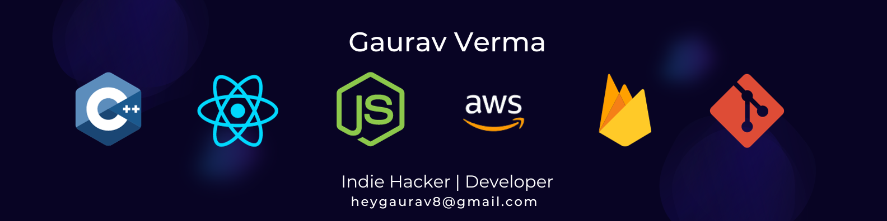

### Hi there, I'm Gaurav  👋

 I'm a Computer Science & Engineering graduate, passionate about Full Stack development and  Open-Source contribution. My expertise spans web applications, API integrations, and AWS cloud services, and I'm eager to bring my problem-solving skills and collaborative nature to your team. Let's create exceptional solutions together. 🌟

### 🤔 About
- **Learning :** Full-Stack ⚡ | Open-Source 🔥 | Cloud ☁️
- **Hobbies :** Books 📚 | Music 🎧
- **Ask me about :** Anything!, I'm happy to help ✌️
- **Pronouns :** He/Him/His 😇
- **Resume/Portfolio :**  Checkout my [Resume](https://drive.google.com/file/d/149egLV6stnrluxCj1gkqgQoR55cz0SKI/view?usp=sharing) 👀
- **Contact :** Feel free to connect me via [Email](mailto:heygaurav8@gmail.com) or [LinkedIn](https://www.linkedin.com/in/vermagaurav8/) 📫

### My Skills

  

### GitHub Stats

  
  
  

